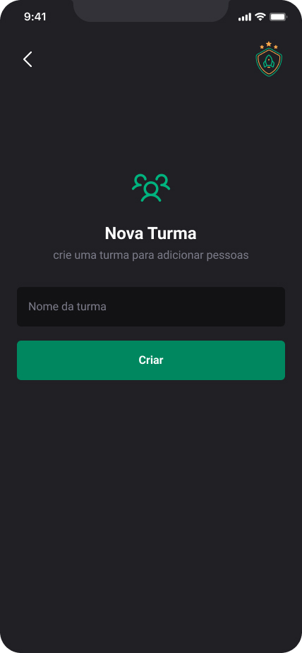
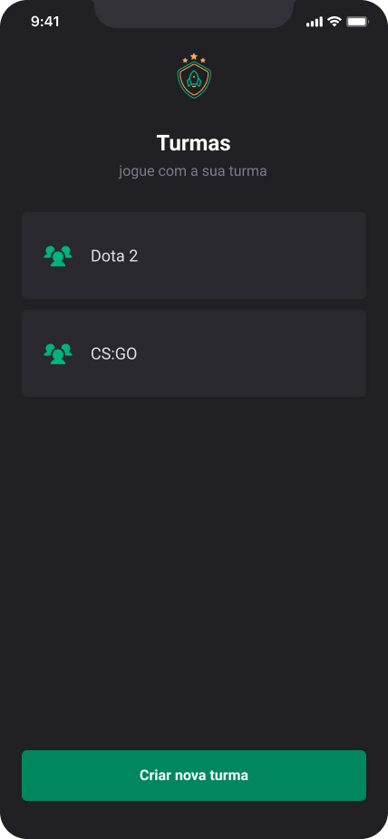

# Ignite Teams

Ignite Teams is a app built with xpo, React Native, and Typescript. It allows users to register games and teams for these different games. The application stores the user-entered data using AsyncStorage in the memory of the mobile device running the app. Within the application, users can create new games, delete existing games, add participants, and remove participants from each game.

## Features

- Register/Delete games
- Register/Delete teamplayers on each team
- Store data on mobile devices

## Screenshots

Here are some screenshots of the project:

    
Click to view images

    <h2>New Game</h2>
    
    <h2 style="margin-top: 50px">Games</h2>
    
    <h2 style="margin-top: 50px">Teams</h2>
    

## Usage

1. Clone this repository to your local machine.
2. Run `npm install` to install dependencies.
3. Run `npm expo start` to start the development server.
4. Scan QR code on terminal using Expo App on you mobile phone or opent it on emulator.

## Technologies Used

- Expo
- React Native
- TypeScript
- Styled Components
- React Navigation
- Phosphor React Native

## Disclaimer

This project was created as part of the Ignite course by Rocketseat" / [@Rocketseat](https://github.com/Rocketseat)
